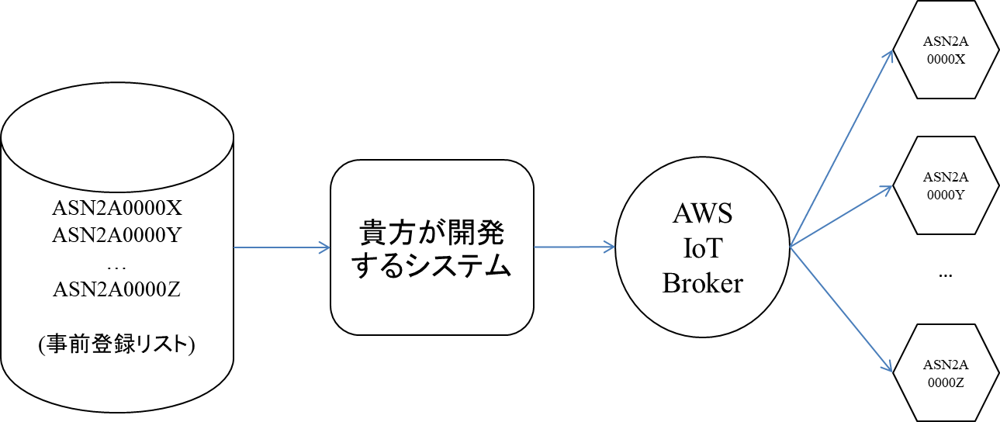

[English](README.md) / [日本語](README-JP.md)
# 世界初デジタル香りハッカソン

Hackaromaのメインページ: [こちら](https://www.aromajoin.com/hackaroma)

1. 概要
   - 期間: 5月13日～6月19日
   - 公式ルール: [PDF](https://drive.google.com/file/d/1pwpCksr0kRWzzq3HsPF0bcMUr-uwWLaL/view)
   - アイデア選考ラウンド（5月13日～5月28日）:
     - 提案書ってどのように作れる？ → [ガイド](https://paper.dropbox.com/doc/Perfecting-your-Hackaroma-Proposal--AzWa4BFYALfWgkcztSeRTRhaAQ-8VblQZyV0ehKdyAmCSeOV)
     - 提案書ってどんなイメージ？→[サンプル](https://www.dropbox.com/s/scac6vm2f5fsuzf/200508_HackaromaProposalTemplateJP.pdf?dl=0)
   - 開発ラウンド（5月28日～6月19日）:
     - 開発に進む6チーム（個人可）は自分のアイデアを実現します。開発キットの発送には努めますが、開発キットが届く前から開発を進めるのが望ましいです。
     
     - アロマシューターはiOS, Android, Java, Javascript, Python, C++等環境でSDKが整っているAWS IoTを使ってインターネットを通して動かせます。もっと見たい人は [こちら](https://docs.aws.amazon.com/iot/latest/developerguide/iot-sdks.html)から見られます。詳しい説明は下に書きます。
     
     - 最終日6月19日（金）後で定める時間にオンライン発表会が行われます。開発に進む6チームは自分のアイデアや実現について発表してデモを行います。デモの時事前に登録されたアロマシューターを持っている人は全て同じ香りを体験できるようにします。それは**世界初香りデータのライブストリーミング**です。
     
     - 開発に進む6チームと遠隔にいる審査員はそれぞれアロマシューターを一台、アロマカートリッジを１セットを持ちます。全てのカートリッジセットは同じで、１セットにあるカートリッジ数は決まっていなんですが、6個以上です。
     
2. アロマシューターを使った事例等
   - [香りを加えた VR](https://www.dropbox.com/s/9xse6isg22fhuw9/200109_VRHeroVideo.mp4?dl=0)
   - [香り Walkman](https://www.youtube.com/watch?v=r9MUcdwxsR4)
   - [リラックス用香り](https://www.youtube.com/watch?v=p1f5A-vXAv8)
   - [アロマサイネージ](https://aromajoin.com/solutions/aroma-signage)
   - [その他](https://aromajoin.com/solutions/arts-and-science)

3. 開発ラウンドでどんな香りが使えますか？

   - 開発に進む6チームが使えるアロマカートリッジのセットが決まりました。各チームはそれぞれアロマシューターキットの一台と下記香りリストの一個ずつもらえます。

     - Chanel #5の模倣
     - マンゴ
     - コーヒー
     - ラベンダー
     - フォレスト
     - ヒノキ
     - スペアミント
     - お香
     - レモン
     - フレッシュな刈った草
     - 燃えたゴム
     - 海

   - 合計12個（種類）ありますが、同時に6種類までアロマシューターで使えます。どう思いますか？何かいいアイデアに繋がりそうですか？


4. どうやってインターネット上アロマシューターを制御できますか？

   

​                                                   *インターネット上アロマシューターを制御する流れ*

(1) 事前登録アロマシューターシリアル番号リストはHackaromaチームからもらいます。

(2) 貴方のシステムはそのリストを使って噴射する時リストに入っている全てのアロマシューターを動かします。開発されるシステムとアロマシューターの間に装置とインターネット上コミュニケートさせるMQTTプロトコルを使っているAWS IoT Brokerが入っています。

(3) 下記は**Python**で書かれた例で、AWS IoT Python SDKを使いました。基本的に [AWS IoT Python SDK](https://github.com/aws/aws-iot-device-sdk-python)を参照しました。AWS IoTがサポートしている他のプラットフォームででも同様に動かせるはずです。

- AWS IoT Python SDKレポジトリに書かれている最小限条件を自分の開発環境が満たしているかを確認してください。

- AWSIoTPythonSDK パッケージをインストールします。

- 下記のコードを実行してAWS IoT Brokerに接続します。

  ```python
  from AWSIoTPythonSDK.MQTTLib import AWSIoTMQTTClient
  
  # For certificate based connection
  myMQTTClient = AWSIoTMQTTClient(Your_client_name_could_be_whatever)
  
  # For TLS mutual authentication
  myMQTTClient.configureEndpoint(provided_endpoint, 8883)
  
  # configure credentials
  # myMQTTClient.configureCredentials("YOUR/ROOT/CA/PATH", "PRIVATE/KEY/PATH", "CERTIFICATE/PATH")
  myMQTTClient.configureCredentials(PEM_file, PEM_key_file, certificate_file)
  
  # infinite offline publish queueing
  myMQTTClient.configureOfflinePublishQueueing(-1)
  
  # draining: 2Hz
  myMQTTClient.configureDrainingFrequency(2)
  
  # 10 secs
  myMQTTClient.configureConnectDisconnectTimeout(10)
  
  # 5 secs
  myMQTTClient.configureMQTTOperationTimeout(5)
  
  # connect to the AWS IoT Broker
  myMQTTClient.connect()
  ```

  

- 上記ソースコードにあるfor *Your_client_name_could_be_whatever*を自分が選ぶ名前にしてください。下記の情報はHackaromaチームが提供します。

  - *provided_endpoint*
  - *PEM_file*
  - *PEM_key_file*
  - *certificate_file*

- AWS IoT Brokerに接続できたら、下記のコードでインターネットを通してアロマシューターを噴射します。

  ```python
  topic = "aromajoin/aromashooter/ASN2A00002/command/diffuse"
  durationInMillis = 3000
  channel = 3
  intensity = 100
  payload = "{ \"duration\": " + str(durationInMillis) + ", \"channel\": " + str(channel) + ", \"intensity\": " + str(intensity) + ", \"booster\": false}"
  myMQTTClient.publish(topic, payload, 0)
  ```

- 下記は引数で自分の用途と合わせて指定して使って下さい。

  - *ASN2A00002*: ここには制御したいアロマシューターのシリアル番号を置き換えてください。
  - *durationInMillis*: ミリ秒で表される噴射時間です。
  - *channel*: 噴射したいアロマシューターのポート番号で、1～6です。
  - *intensity*: 噴射強度で0～100です。100は一番強いという意味です。
