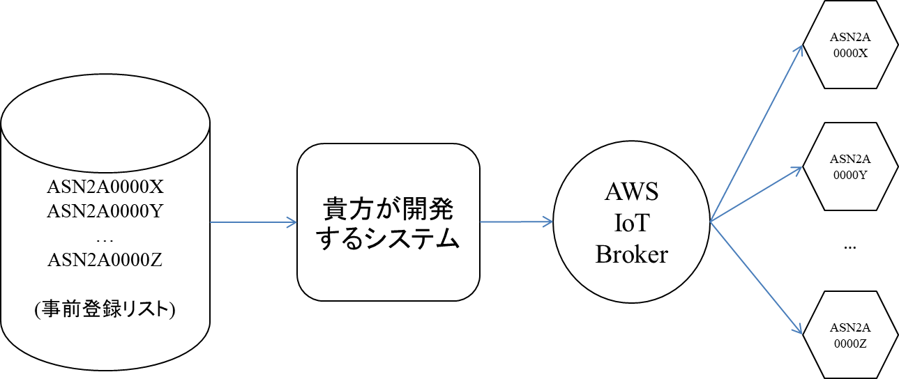

4. どうやってインターネット上アロマシューターを制御できますか？



​                                                   *インターネット上アロマシューターを制御する流れ*

(1) 事前登録アロマシューターシリアル番号リストはHackaromaチームからもらいます。

(2) 貴方のシステムはそのリストを使って噴射する時リストに入っている全てのアロマシューターを動かします。開発されるシステムとアロマシューターの間に装置とインターネット上コミュニケートさせるMQTTプロトコルを使っているAWS IoT Brokerが入っています。

(3) 下記は**Python**で書かれた例で、AWS IoT Python SDKを使いました。基本的に [AWS IoT Python SDK](https://github.com/aws/aws-iot-device-sdk-python)を参照しました。AWS IoTがサポートしている他のプラットフォームででも同様に動かせるはずです。

- AWS IoT Python SDKレポジトリに書かれている最小限条件を自分の開発環境が満たしているかを確認してください。

- AWSIoTPythonSDK パッケージをインストールします。

- 下記のコードを実行してAWS IoT Brokerに接続します。

  ```python
    from AWSIoTPythonSDK.MQTTLib import AWSIoTMQTTClient
  
    # For certificate based connection
    myMQTTClient = AWSIoTMQTTClient(Your_client_name_could_be_whatever)
  
    # For TLS mutual authentication
    myMQTTClient.configureEndpoint(provided_endpoint, 8883)
  
    # configure credentials
    # myMQTTClient.configureCredentials("YOUR/ROOT/CA/PATH", "PRIVATE/KEY/PATH", "CERTIFICATE/PATH")
    myMQTTClient.configureCredentials(PEM_file, PEM_key_file, certificate_file)
  
    # infinite offline publish queueing
    myMQTTClient.configureOfflinePublishQueueing(-1)
  
    # draining: 2Hz
    myMQTTClient.configureDrainingFrequency(2)
  
    # 10 secs
    myMQTTClient.configureConnectDisconnectTimeout(10)
  
    # 5 secs
    myMQTTClient.configureMQTTOperationTimeout(5)
  
    # connect to the AWS IoT Broker
    myMQTTClient.connect()
  ```

- 上記ソースコードにあるfor *Your_client_name_could_be_whatever*を自分が選ぶ名前にしてください。下記の情報はHackaromaチームが提供します。

  - *provided_endpoint*
  - *PEM_file*
  - *PEM_key_file*
  - *certificate_file*

- AWS IoT Brokerに接続できたら、下記のコードでインターネットを通してアロマシューターを噴射します。

  ```python
    topic = "aromajoin/aromashooter/ASN2A00002/command/diffuse"
    durationInMillis = 3000
    channel = 3
    intensity = 100
    payload = "{ \"duration\": " + str(durationInMillis) + ", \"channel\": " + str(channel) + ", \"intensity\": " + str(intensity) + ", \"booster\": false}"
    myMQTTClient.publish(topic, payload, 0)
  ```

- 下記は引数で自分の用途と合わせて指定して使って下さい。

  - *ASN2A00002*: ここには制御したいアロマシューターのシリアル番号を置き換えてください。
  - *durationInMillis*: ミリ秒で表される噴射時間です。
  - *channel*: 噴射したいアロマシューターのポート番号で、1～6です。
  - *intensity*: 噴射強度で0～100です。100は一番強いという意味です。
